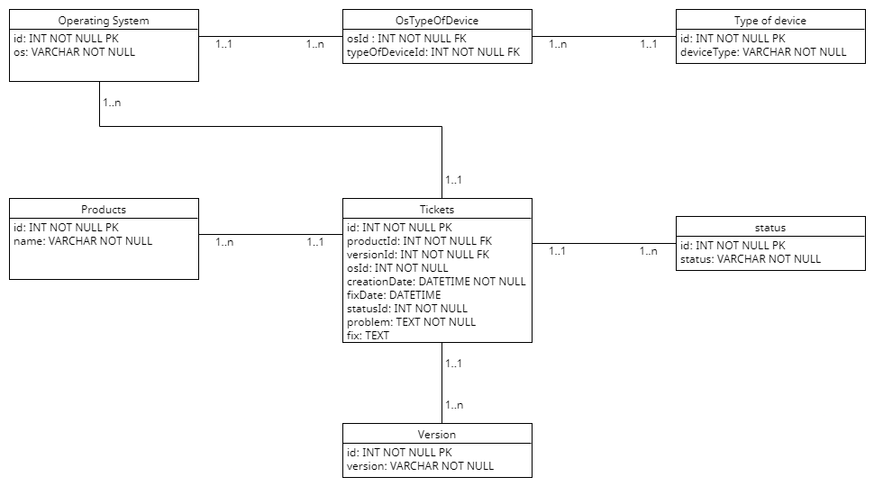

# OC-Rendus-P6

## Description du projet
Ce dépôt contient le travail réalisé dans le cadre du projet 6 d'OpenClassrooms : **Modélisez et créez une base de données pour une application .NET**.

L'objectif principal du projet est de concevoir et de mettre en œuvre une base de données relationnelle permettant de gérer le suivi des problèmes rencontrés sur les différents produits logiciels de l'entreprise **NexaWorks**. Chaque produit dispose de plusieurs versions compatibles avec divers systèmes d'exploitation. La base de données doit permettre de suivre les problèmes identifiés, leur résolution, et les informations associées.

## Contenu du dépôt
Le dépôt contient les éléments suivants :
- **Modèle conceptuel de données (MCD)** : Un diagramme décrivant les relations entre les différentes entités. (Voir ci-dessous)
- **Dossier Requetes SQL et SP** : Les différents scripts SQL pour la création de la BDD, le peuplement des données, les SP et les requetes demandées.
- **Dossier Requetes LINQ** : Un document Linq avec toutes les requetes une par une, et deux documents contenant chacun des requetes optimisées.
- **Dump de la base de donnée** : La sauvegarde de la base au format .bak

## Modèle conceptuel de données
Voici le modèle conceptuel de données conçu pour ce projet :



## Objectifs du projet
1. Concevoir un modèle de données répondant aux besoins de gestion des problèmes des produits logiciels de NexaWorks.
2. Créer un script SQL permettant de générer la base de données.
3. Générer des données factices pour tester le modèle et valider son fonctionnement.
4. Documenter l'ensemble du projet et expliquer les choix de conception.

## Instructions
1. Clonez ce dépôt :  
   ```bash
   git clone https://github.com/votre-utilisateur/OC-Rendus-P6.git
2. Accédez au dossier du projet :
Exécutez le script SQL dans votre SGBD préféré pour créer la base de données.
Insérez les données factices en exécutant les scripts de peuplement.

Technologies utilisées
Langage SQL : Pour la création et le peuplement de la base de données.
MySQL ou SQL Server : Les scripts sont compatibles avec ces systèmes de gestion de bases de données.
Logiciel de modélisation : Pour la conception du MCD.

## Notes :

Ce projet est réalisé dans un cadre pédagogique. Les données et scénarios sont fictifs et ont pour but d'illustrer une problématique de conception de base de données dans le développement de logiciels.

Si vous avez des questions ou des retours, n'hésitez pas à ouvrir une issue ou à me contacter.

**Auteur** : Gregoire Bouteillier - gregoire.bouteillier@gmail.com

**Date** : Novembre/Décembre 2024

